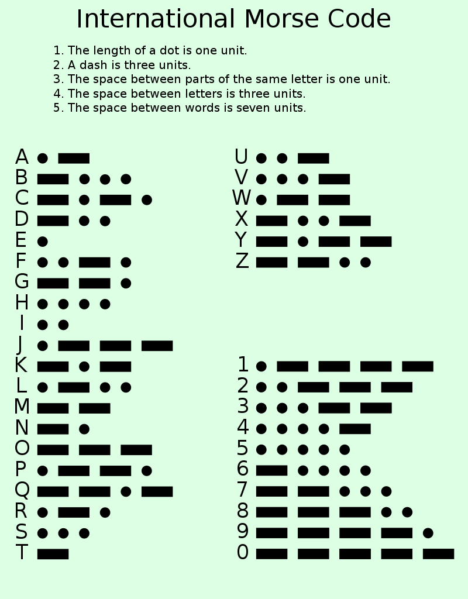

# Morse-Code-Text

A simple text-based Morse code encoder-decoder given as an assignment in a Python course.

It is based on the standard notations of Morse code.
It has **26 letters & 10 numerals**.

**⚠️ Any special character is truncated from the text...**

